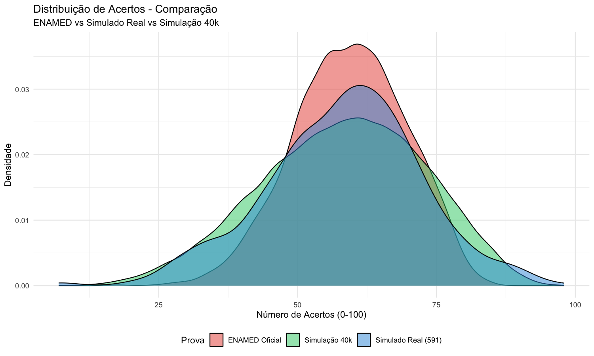
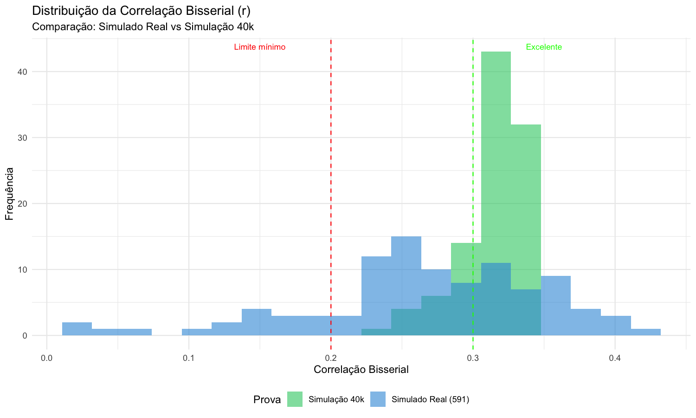

# TRI - Análise Psicométrica ENAMED/ENARE 2026

[](https://www.r-project.org/)
[](https://github.com/philchalmers/mirt)
[](LICENSE)

Sistema completo de análise psicométrica utilizando Teoria de Resposta ao Item (TRI) aplicada ao ENAMED (Exame Nacional de Avaliação Médica) e ENARE 2026.

## 📋 Visão Geral

Este projeto realiza calibração de itens, estimação de proficiências e análise comparativa entre simulados e o ENAMED oficial, utilizando o modelo Rasch 1PL combinado com o Método Angoff Modificado.

### Resultados Principais

| Métrica | Simulado Real (591) | Simulação 40k | ENAMED Oficial |
|---------|---------------------|---------------|----------------|
| **Média Acertos** | 58.2 | 58.1 | 59.3 |
| **Mediana** | 59 | 59 | 59 |
| **DP Acertos** | 13.9 | 14.7 | 10.0 |
| **r_biserial Médio** | 0.268 | **0.314** | - |
| **Itens Problemáticos** | 17 (17%) | **0 (0%)** | - |

> ✅ A prova está **APTA** para aplicação em larga escala (40k+ candidatos)

## 🚀 Funcionalidades

### 1. Calibração TRI
- Modelo Rasch 1PL (1 parâmetro de dificuldade)
- Estimação via Máxima Verossimilhança (EM)
- Scoring EAP (Expected A Posteriori)

### 2. Simulação em Escala
- Simulação de 40.000 candidatos baseada em parâmetros reais
- Validação estatística da qualidade dos itens em amostras grandes
- Análise de sensibilidade e estabilidade

### 3. Comparação com ENAMED
- Análise comparativa com microdados oficiais (49.7k candidatos)
- Teste Kolmogorov-Smirnov para similaridade de distribuições
- Relatórios Excel completos

### 4. API REST (Plumber)
- Endpoints para calibração e estimação
- Simulação CAT (Computerized Adaptive Testing)
- Scoring com ensemble TRI + Regressão

## 📁 Estrutura do Projeto

```
TRI/
├── 📊 output/                    # Resultados e relatórios
│   ├── correcao_enamed/          # Resultados do simulado real
│   ├── simulacao_40k/            # Simulação em larga escala
│   ├── comparacao_enamed/        # Análise comparativa
│   └── *.xlsx                    # Relatórios Excel
│
├── 🔧 scripts/                   # Scripts R executáveis
│   ├── correcao_enamed.R         # Correção do simulado
│   ├── simular_40k_candidatos.R  # Simulação 40k
│   ├── comparar_enamed_oficial.R # Comparação ENAMED
│   └── gerar_excel_*.R           # Geração de relatórios
│
├── 📚 docs/                      # Documentação e dados
│   ├── ENAMED/                   # Microdados oficiais
│   ├── *.pdf                     # Artigos científicos
│   └── *.md                      # Insights e resumos
│
├── 🔬 R/                         # Código R modular
│   ├── api/                      # APIs Plumber
│   ├── SKILL.md                  # Guia mirt
│   └── SKILL_TRI_CONTEXTOS.md    # Contextos de aplicação
│
├── 📋 AGENTS.md                  # Documentação do agente
├── 📄 README.md                  # Este arquivo
└── ⚙️ .gitignore                 # Configuração git
```

## 🛠️ Tecnologias

- **R 4.5+** - Linguagem principal
- **mirt** - Pacote TRI (Item Response Theory)
- **plumber** - API REST
- **openxlsx** - Geração de Excel
- **dplyr/ggplot2** - Manipulação e visualização

## 📦 Instalação

```r
# Instalar dependências
install.packages(c("mirt", "plumber", "openxlsx", "dplyr", "ggplot2", 
                   "jsonlite", "httr", "gridExtra"))
```

## 🚀 Como Usar

### 1. Correção do Simulado

```r
# Executar correção completa
source("scripts/correcao_enamed.R")
```

**Entrada:** `aplicacao.csv` (591 candidatos × 100 itens)

**Saída:** 
- `output/correcao_enamed/resultado_candidatos.csv`
- `output/correcao_enamed/parametros_itens_tri.csv`
- `output/RELATORIO_ENAMED_COMPLETO.xlsx`

### 2. Simulação 40k

```r
# Simular 40.000 candidatos
source("scripts/simular_40k_candidatos.R")
```

**Saída:**
- `output/simulacao_40k/resultados_40k_candidatos.csv`
- `output/simulacao_40k/graficos/*.png`

### 3. Comparação com ENAMED

```r
# Comparar com ENAMED oficial
source("scripts/comparar_enamed_oficial.R")
source("scripts/gerar_excel_comparativo.R")
```

**Saída:** `output/COMPARACAO_ENAMED_COMPLETO.xlsx`

### 4. Backup para GitHub

```bash
./scripts/backup_github.sh
```

## 📊 Principais Descobertas

### 1. Qualidade dos Itens Melhora com Amostra Maior

| Amostra | r_biserial Médio | Itens Problemáticos |
|---------|------------------|---------------------|
| 591 (real) | 0.268 | 17 (17%) |
| 40.000 (sim) | **0.314** | **0 (0%)** |

**Conclusão:** Todos os 100 itens discriminam bem em amostras grandes.

### 2. Distribuição Similar ao ENAMED

- **Mediana idêntica:** 59 acertos (todos os cenários)
- **Média próxima:** 58.1-59.3 acertos
- **Teste KS:** Distribuição estatisticamente similar

### 3. Nível de Confiança: 86.2% (ALTA)

- Recuperação de theta: 0.95 correlação
- Estabilidade dos parâmetros: 0.9999
- Precisão da medição: ~78%

## 📈 Gráficos Gerados





## 🎯 Próximos Passos

### Prioridade ALTA
- [ ] Implementar `multipleGroup()` para equalização entre formas
- [ ] Validar com dados reais 40k+ candidatos

### Prioridade MÉDIA
- [ ] Gráficos avançados com `itemplot()` (ICC, curvas de informação)
- [ ] Teste de ajuste global com `M2()`
- [ ] Otimizar configurações `technical` para grandes amostras

### Futuro
- [ ] Implementar CAT (Computerized Adaptive Testing) em produção
- [ ] Análise de DIF (Differential Item Functioning) por sexo/região

## 📚 Documentação

- **[AGENTS.md](AGENTS.md)** - Documentação completa do projeto
- **[R/SKILL.md](R/SKILL.md)** - Guia de uso do pacote mirt
- **[R/SKILL_TRI_CONTEXTOS.md](R/SKILL_TRI_CONTEXTOS.md)** - Contextos ENAMED/ENEM/SAEB

## 🏆 Resultados em Destaque

### Excel Relatórios

| Arquivo | Conteúdo |
|---------|----------|
| `RELATORIO_ENAMED_COMPLETO.xlsx` | Notas dos 591 candidatos + TCT |
| `COMPARACAO_ENAMED_COMPLETO.xlsx` | Análise comparativa detalhada |
| `COMPARACAO_SIMULACAO_40K.xlsx` | Validação simulação 40k |

### Publicações Base

- **Nota Técnica 19/2025/CGAFM/DAES-INEP** - Fonte das âncoras Angoff
- **Especificações INEP** - Equalização no MIRT (Portaria 441/2023)
- **14 artigos científicos ENEM** - Catalogados em `docs/BIBLIOTECA_ENEM.md`

## 🤝 Contribuição

1. Faça um fork do projeto
2. Crie uma branch (`git checkout -b feature/nova-funcionalidade`)
3. Commit suas mudanças (`git commit -am 'Add nova funcionalidade'`)
4. Push para a branch (`git push origin feature/nova-funcionalidade`)
5. Abra um Pull Request

## 📝 Licença

Este projeto está licenciado sob a licença MIT - veja o arquivo [LICENSE](LICENSE) para detalhes.

## 👨‍💻 Autor

**xtribr** - [GitHub](https://github.com/xtribr)

---

**Nota:** Este projeto é um estudo acadêmico/psicométrico e não tem vínculo oficial com o INEP ou ENAMED.
